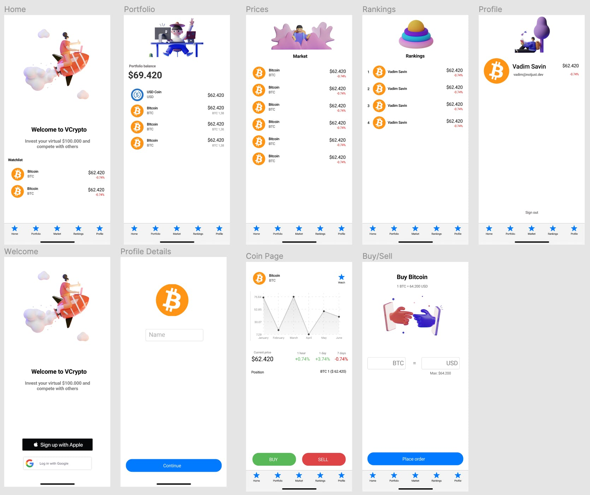
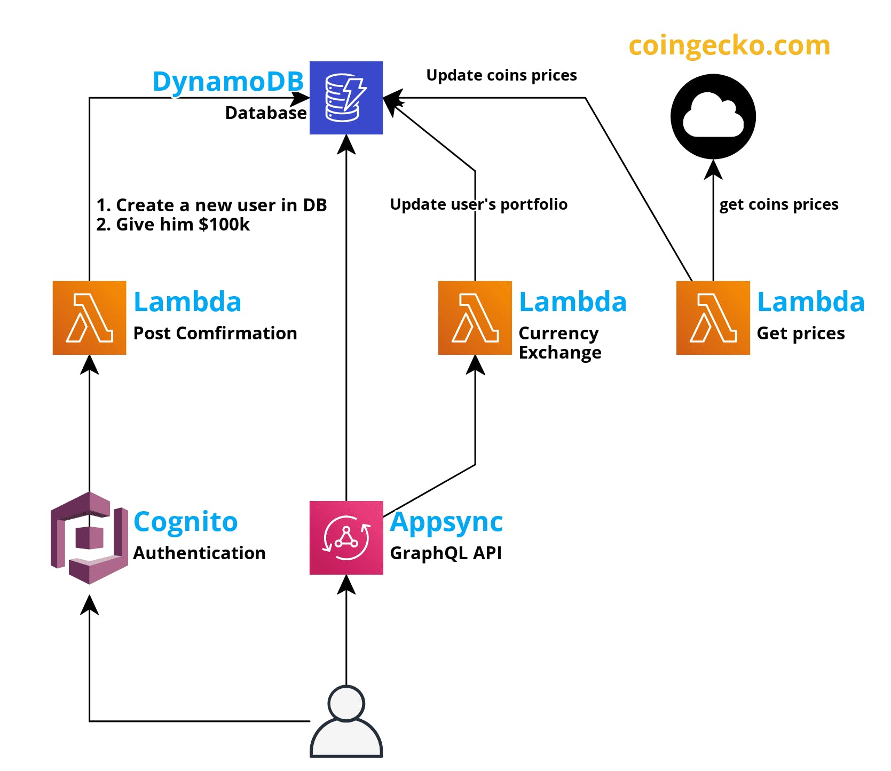
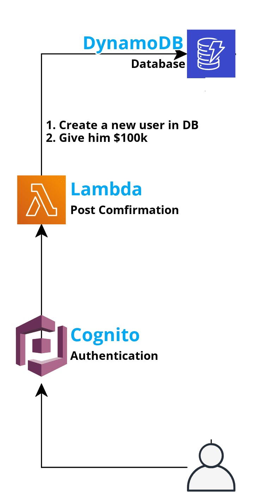
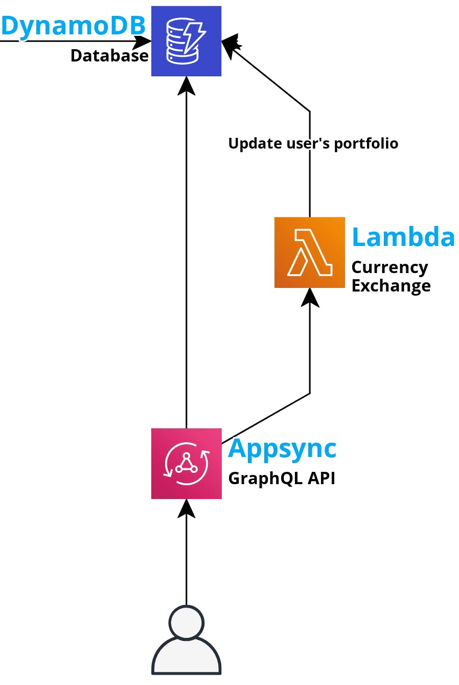
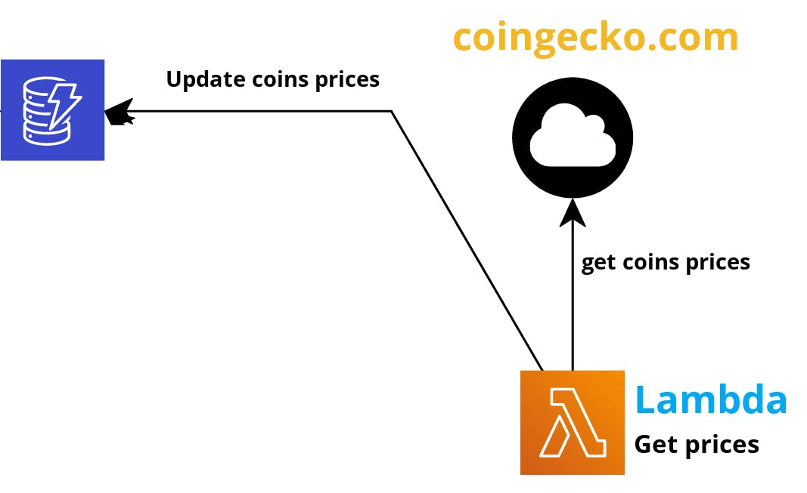

From the time I started doing youtube, I had this idea in mind to do a 12H Livestream and to build something. It was inspired by the extreme challenges of Mr. Beast's. However, I always procrastinated doing it because I was kinda scared (12 hours coding with no break??😱), but when I saw the #AmplifyHashnode hackathon organized by Hashnode and Amplify, I knew this is the time for it. Also, I kinda missed the hackathon's atmosphere, where we used to build working prototypes in 48h with 4 hours of sleep (and lots of coffee).

[Here is the 12 hours Stream](https://www.youtube.com/watch?v=xJM2yNUYeIs)

# App Idea

When it comes to investments, I am a bit old school, and because of that, I have never owned any cryptocurrencies. That doesn't mean that I am not wondering what would have happened if I had invested $10k in bitcoin in 2016 (hell yeah, I am). Also, with the latest things happening around the DogeCoin 🚀, the FOMO is even stronger.

The solution for me (and other broke people) would be a platform where I can invest virtual money in cryptocurrencies and wait until the portfolio reaches the moon 🚀 or goes bust.

That's what we are going to build during the 12H Livestream. A virtual crypto investment platform where people will invest and also compete with each other in a global leaderboard to see who is the best crypto investor.

Thanks to the [notJust Development](https://discord.gg/SX75jruWTj) gang, we came up with the name _VCrypto_, and I quickly created the logo with a logo generator website. The 2 most important steps are done (name & logo). That's already better than half of my startup ideas 🤷

# Tech stack

I am going to use React Native and Expo for the mobile application. This will allow me to build the app for both iOS and Android. I also used Typescript because what's a better way of spending 10% of the 12H than defining types?

For the backend, I will use AWS Amplify. More about it later.

# VCrypto Design

A day before the Livestream, I sketched some screens using Figma, to have an idea of what I am going to build. Here is the result. (That moment when you find some free illustration and you end up overusing them 🙈)



- **Home Screen** will display a greeting message and the watchlist
- **Portfolio Screen** will display all the cryptocurrencies you have bought and will show you the account balance, which is the sum of the dollar value of all cryptos in the portfolio.
- **Market Screen** will display all available cryptocurrencies that you can trade, with their real-time price
- **Rankings Screen** is where we will see the global leaderboard
- **Coin Page** will show us more information about a specific cryptocurrency (look, there are graphs
  📈)
- **Buy/Sell** page will do.... guess what?

Ok, enough of the boring stuff, who cares about design, right?

# Architecture

Let's get to the juicy part 🤩

The backend was created using AWS Amplify (ofc). Let's see the architecture diagram of the whole system, and down below, I will get into details and explain every part of it.



### Authentication

For Authentication, Amplify uses Amazon Cognito which helps us manage users and identities. Amplify authentication comes with prebuilt components for login, sign up and forget password screens. This is great because it allows you to set up authentication in your app with literally 3 lines of code. On the other hand, I wanted to make it as easy as possible to sign up and start using VCrypto (people are lazy). That's why I decided to setup authentication with social providers: sign up with google and with apple.

The next challenge was to save the authenticated users in the database and also to give them the promised virtual $100,000 (how generous of me, isn't it?). To solve this, I created a custom Lambda function that is triggered each time an account is confirmed in Cognito. The Lambda function inserts the user in the UserTable DynamoDB and also inserts the portfolio coin for the virtual USDs.



### GraphQL API

For the API, Amplify uses AWS AppSync and it makes it super easy to create GraphQL or Restful APIs. You just have to specify the GraphQL schema, and the rest is taken care of by Amplify. Bellow, you can see the schema for VCrypto:

```graphql
type User
  @model(mutations: null)
  @key(
    name: "byNetworth"
    fields: ["type", "networth"]
    queryField: "getUsersByNetworth"
  ) {
  id: ID!
  type: String!
  email: String!
  name: String
  image: String
  networth: Float!

  portfolioCoins: [PortfolioCoin] @connection(keyName: "byUser", fields: ["id"])
}

type PortfolioCoin
  @model(mutations: null)
  @key(name: "byUser", fields: ["userId"]) {
  id: ID!
  amount: Float!

  userId: ID!
  user: User @connection(fields: ["userId"])

  coinId: ID!
  coin: Coin @connection(fields: ["coinId"])
}

type Coin @model(mutations: null) {
  id: ID!
  cgId: String!
  name: String!
  symbol: String!
  image: String
  currentPrice: Float!
  valueChange24H: Float!
  valueChange1D: Float!
  valueChange7D: Float!
  priceHistoryString: String
}

type Mutation {
  exchangeCoins(
    coinId: ID!
    isBuy: Boolean!
    amount: Float!
    usdPortfolioCoinId: ID
    coinPortfolioCoinId: ID
  ): Boolean! @function(name: "ExchangeCoins-${env}")
}
```

### Currency Exchange Lambda

For the process of exchanging currencies (buying or selling cryptocurrencies), I wrote a custom lambda. That allowed me to secure this process with extra checks and prevent unwanted currency exchanges. When buying a coin, I check if the user has enough USD coins, and when selling a coin, I check if the user has enough coins to sell.


### Fetch Cryptocurency prices

To get all the data about the current cryptocurrencies including the current price, the last 7-day history, the price changes, and so on, we used the [CoinGecko](https://www.coingecko.com/en) API. It is a free-to-use API and provides data about more than 6k cryptocurrencies.

I created a Lambda function that is triggered every 5 minutes. The lambda function queries the data of the top 50 cryptocurrencies from coingecko (50 to keep it simple) and saves it to DynamoDB to be accessed by the app.


# Summary

That was a really fun challenge, and I am super proud of the result that we have achieved in just 12H. We have managed to build a fully functional app, which is not a TODO list, and we have managed to deploy it to the store.

Thanks to everyone for reading and following my process. You can download the app from the market, and I would appreciate your constructive feedback.

Here are the important links:

- [Youtube 12H Livestream](https://www.youtube.com/watch?v=xJM2yNUYeIs&t=3s)
- [Source Code](https://github.com/rookasrudzianskas/CryptoKingdom)
- [Open the app in Expo Go](https://expo.io/@rookasrudzianskas/projects/CryptoKingdom)
- [Download iOS app (coming soon. still in review)]()
- [Download Android app (coming soon. still in review)]()
