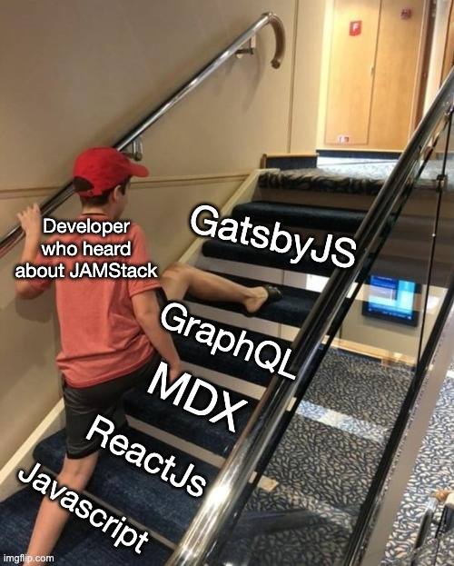

import Counter from './components/Counter.tsx'

The previous version of this platform was built using [GatsbyJS](https://www.gatsbyjs.com/), which is a framework on top of ReactJS that offers SSG (Static Site Generation). In other words, you write the website using the beloved ReactJS and Gatsby builds it to a static website (html, css, javascript).

I started the website from a very opinionated template, that had thousands of libraries, and all the buzzwords that you can hear in the javascript world. I did not understand half of the things that was going on there, and that made it annoyingly painful to work on it and update it. This is literally me. Don't be like me.



Ok, Gatsby might not be my bestie, but there is always that neighbor's kid, who is always better than you. In this case, the neighbor's kid is NextJS.

## NextJS

NextJS is a framework for ReactJS that offers both SSG (Static Site Generation) and SSR (Server Side Rendering). With NextJS, we can create hybrid application, where part of our web app is SSG and the other part is SSR.

The pages that are not updated often and do not depend on real time data are a perfect candidate to be built and exported to static files at build time. Think about landing page, about us page, FAQ, and even blog posts pages.

For the dynamic content, that is updated often, that depends on real time data or that is of an unreasonable amount, we use SSR. A good candidate for this would be the TikTok web pages for each post. It would be impossible to build a page for each post during build time. For that reason, when the users visits a post page, the server will fetch the data, will render the ReactJS page, and will send back to the browser the rendered HTML, CSS, Javascript page.

This approach has a lot of benefits but the most important ones are speed and SEO optimisation. If you want to learn more, checkout [NextJS](https://nextjs.org/) website.

## Tech Stack

This time, I am starting from scratch, and I will add a new technology or library only when needed. I want to keep the project clean, to be easier to maintain and grow in future.

As I already mentioned, at the base of the stack is [NextJS](https://nextjs.org/).

To style everything, I used [TailwindCSS](https://tailwindcss.com/). This is a utility CSS library. It's not a "cosmetic" library like Bootstrap. It just gives us pre-made class names for all possible css option, so that we can style an HTML without writing any CSS. It definitely makes the development process faster, especially when you already know all the class names, but it comes with the price of decreased readability of your code.

Here is the component for our Blog card. It is responsive and I did not write any line of CSS for it. But it's kinda messy.

```jsx
const BlogCard = ({ post }: BlogCardProps) => (
  <div className="bg-custom-blue-500 p-2 pb-5 flex flex-col items-center cursor-pointer">
    <div className="relative w-full aspect-w-16 aspect-h-9 mb-2">
      <Image ... />
    </div>

    <h2 className="p-2 w-full text-center md:text-left">{post.title}</h2>
    <p className="p-2 text-center md:text-left font-light">
      {post.description}
    </p>
    <Button text="Read more" />
  </div>
);
```

## MDX

The data for the blog posts is written in markdown (.md) files. If you don't know about the markdown format, you saw at least once a `README.md` file. That's markdown format.

This give me the possibility to write the content right in VSCode. In the end, all the `# Titles` will be transformed to `<h1>Titles</h1>`, and all \[urls](https://notjust.dev) will be transofrmed to `<a href="https://notjust.dev" alt="urls />`

But that's not enough. The power comes with MDX, which extends the MD format, and gives us the possibility to use Custom React Components inside our markdown files.

> Ok, but what can you do with it?

This:
<Counter />

This was a custom component I created, and now I can include it in my markdown file as `<Counter />` and during the build time, it will render the actual component.

It is all made possible by the [mdx-bundler](https://github.com/kentcdodds/mdx-bundler) library. It was recommended by Josh Comeau in this [blog post](https://www.joshwcomeau.com/blog/how-i-built-my-blog/#using-mdx-with-nextjs).

As alternatives, Josh recommends the next libraries, which I have not tried:

1. The official way, with [@next/mdx](https://www.npmjs.com/package/@next/mdx)
2. Hashicorp's [next-mdx-enhanced](https://github.com/hashicorp/next-mdx-enhanced)
3. Hashicorp's [next-mdx-remote](https://github.com/hashicorp/next-mdx-remote)

## Images

I wanted to make the images inside the blog posts be rendered using the `next/image` component, to get the optimisations benefits. For that, I created a custom wrapper component that uses `next/image` and I replace all `` components generated by the bundler, with my `MDXImage` component.

```jsx
import { getMDXComponent } from 'mdx-bundler/client';

function BlogPostPage({ post }: Props) {
  const Component = useMemo(() => getMDXComponent(post.code), [post]);
  return (
    <Component
      components={{
        img: MDXImage as React.ComponentType<{}>,
      }}
    />
  )
}
```

```jsx
import React from 'react';
import Image from 'next/image';

interface Props {
  src: string;
  alt: string;
}

const MDXImage = ({ src, alt }: Props) => (
  <div className="aspect-w-16 aspect-h-9 relative my-7">
    <Image src={src} alt={alt} layout="fill" objectFit="contain" />
  </div>
);

export default MDXImage;
```

I also wanted to keep the images related to a blog post, close to the `.md` file. I ended with a structure, where each blog post is a directory containing `index.md` for the markdown content, and all the images that are used in the blog post. To use a image in markdown, all I have to do is write \!\[image alt](./image.png).

The last step was to copy all the images at build time from the `content` folder, to the public folder to be able to distribute them. For that, I had to use the [remark-mdx-images](https://www.npmjs.com/package/remark-mdx-images) plugin, and to tell `esbuild` to copy all the images to the public folder. Here is the end configuration

```jsx
const { code, frontmatter } = await bundleMDX(fileContents, {
  cwd: dirname(fullPath),
  xdmOptions: (options) => ({
    ...options,
    remarkPlugins: [...(options.remarkPlugins || []), remarkMdxImages],
  }),
  esbuildOptions: (options) => ({
    ...options,
    outdir: `./public/images/content/posts/${realSlug}`,
    loader: {
      ...options.loader,
      '.png': 'file',
      '.jpeg': 'file',
      '.jpg': 'file',
    },
    publicPath: `/images/content/posts/${realSlug}`,
    write: true,
  }),
});
```

## Code Snippets

What kind of tech blog without code snippets. For this, I used the [prism-react-renderer](https://github.com/FormidableLabs/prism-react-renderer) library. For the color theme, I use the Palenight, that comes with the library.

I created 2 components, one for multiline code snippets, and one for inline code. I then replace the `pre` element with the `StaticCodeSnippet` component, and the `code` with the `InlineCodeSnippet`.

```jsx
import { getMDXComponent } from 'mdx-bundler/client';

function BlogPostPage({ post }: Props) {
  const Component = useMemo(() => getMDXComponent(post.code), [post]);
  return (
    <Component
      components={{
        pre: StaticCodeSnippet,
        code: InlineCodeSnippet,
      }}
    />
  );
}
```

## Deployment

Being so loyal to AWS, I tried to deploy it using Amplify. After a lot of trial and errors, I managed to deploy it, but I soon found out that `next/image` component is not yet supported on Amplify.

After some time, I gave up, and decided to try to deploy on [Vercel](https://vercel.com/), which is the company behind NextJS. It felt like I am cheating on AWS.

Maaaan, I was blown away by how fast and easy it is to deploy a NextJS app on Vercel. It took me around 3 minutes to signup, deploy and check my website in production. Everything worked from the first try.


## Open source

The website is [open source on github](https://github.com/rookasrudzianskas/byrookas), so if you want to dive deeper into the details, feel free. If you find any issues, you are welcome to open a PR, it will be much appreciated.

## Future plans

At the moment the website is a landing page and a blog. This is just the beginning and I have a lot of plans for it.

The biggest reason I want to work on this platform, is the Project Based Tutorials. I want to gather all the projects that we have build on the [youtube channel](https://www.youtube.com/channel/UCYSa_YLoJokZAwHhlwJntIA) on this website in order to make them easily browseable.

Each project will have it's own page, containing information about the end result, about the skills and technologies that you are going to learn and the links to all the episodes. Moreover, I want to add a short intro video for each project, that will give you an overview about the project and why you should follow it. I know that it is hard to invest blindly 6-10 hours of your time to follow along a project, and that's why I want to make it more transparent and easy for you to learn with me.

On the discoverability side, I want to make it possible to search and filter projects. Initially this can be on a more general level, such as search or filter by:

- front end technologies
- back end technologies
- libraries
- complexity
- time to complete

Later we can also incorporate searches and filter by the smallest features. I have received a lot of messages that people are referring back to my content when they have to implement a feature. For example, if you want to build a real-time chatting feature, you check that part during the [WhatsApp clone](https://youtu.be/EvSUJ5lUcBw). If you want a Image carousel, you check the [Amazon clone](https://youtu.be/WuAMLwrYu68). The problem is that it is quite hard to find this features, and it is only possible if you have followed along that build and you remember. With the new platform, you will be able to search "Maps" and it will show you the Uber clone and the Airbnb clone, and the minute at which it is implemented.

## Conclusion

I had a really fun week building the platform and learning NextJS at the same time. If you have any feedback, feel free to tweet it to me [@byRookas](https://twitter.com/byRookas).
